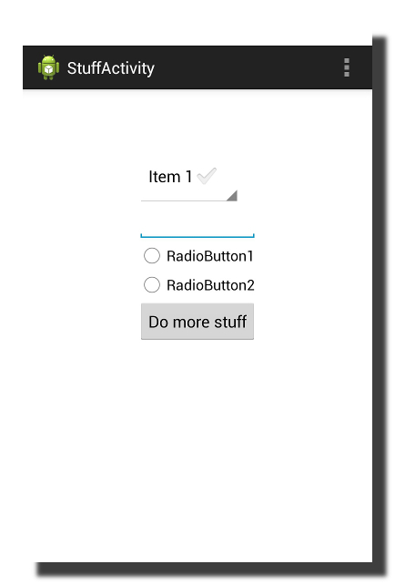

Robotium-Sandwich
=================

Create abstract and simple automated UI tests for Android apps


Introduction
------------

Building large and scalable test suites using Robotium can be a challenging task. Without a carefully designed abstraction 
library, one can quickly end up with tests that are impossible to maintain, difficult to expand, and full of boiler-plate 
code. 
Robotium-Sandwich is a library built on top of Android instrumentation and Robotium to address this problem.
Robotium-Sandwich makes it super easy to create [page object](http://martinfowler.com/bliki/PageObject.html) like definitions for different screens of your app and to write
abstract tests free of boiler-plate code.


Concept
-------

The Robotium-Sandwich test suite is broken into two parts: screen definition classes and the tests themselves. Every screen class
maps to a different screen of your app and contains definitions of widgets within that screen. This approach (similar to
the page object pattern) allows you to write tests that treat screens as objects and their widgets as object 
properties. What's unique about Robotium-Sandwich is that you don't have to find and retrieve a specific widget every time
your test code needs to interact with it. 
A quick example will make it much clearer. Consider the following activity that contains a spinner, text edit, two radios, and a button in its layout:



A complete Sandwich definition for this screen is as simple as the following skeleton class:

```java
public class StuffScreen extends AScreen {

	public StuffScreen() {
		super(StuffActivity.class);
	}
	
	@AIndex(0)
	public ARadioButton radio1;
	
	@AIndex(1)
	public ARadioButton radio2;
	
	@AId(com.appthwack.sampleapp.R.id.sample_edittext)
	public AEditText sample_edittext;
	
	@AText("Do more stuff")
	public AButton do_more_stuff;
	
	@AId(com.appthwack.sampleapp.R.id.my_spinner)
	public ASpinner my_spinner;

}
```

With the screen definition in place you can quickly write an abstract script that looks like this:

```java
	public void testStuff() {

		StuffScreen stuffScreen = new StuffScreen();
		stuffScreen.my_spinner.selectItemAt(1);
		stuffScreen.radio2.click();
		stuffScreen.sample_edittext.enterText("Some stuff")
		stuffScreen.do_more_stuff.click();

	}
```

Robotium-Sandwich takes care of the rest behind the scenes. It will find and retrieve a widget associated with a given
widget field (e.g. `stuffScreen.do_more_stuff` will map to a view of `Button` type with the text "Do more stuff") and it will
perform a requested action on that widget (using the familar Robotium implementation in most cases).

Download
------------

Simply download [our latest jar](https://dl.dropboxusercontent.com/s/kiznsylowplb83b/robotium-sandwich.jar?dl=1&token_hash=AAELqMdqukhR0o2Jmj9beieaA5erzUE1-B7TzbnMYpqhiw) and add it to your test project (coming to Maven Central soon to make it even easier). Please remember the latest [Robotium jar](https://robotium.googlecode.com/files/robotium-solo-4.3.1.jar) if you want to use any of the Robotium functionality directly.

Screen classes
--------------

Robotium-Sandwich screen classes are very easy to define. Simply derive your class from `AScreen`, pass a target activity
class to the default constructor, and define any number of widgets as public fields. Every widget field must be of a type that derives from `AView` and is typically annotated with an `@A*` identifier. If no identifier is provided, Sandwich will associate the field with the first occurence of a widget of a given type (`@AIndex(0)` being the default identifier).

Screen classes can also contain methods that implement the business logic of an app. This is a highly recommended design pattern that will result in even more abstract and maintanable tests.


Widgets and identifiers
-----------------------

The library comes with a number of predefined widget types that map to different Android view classes. A complete list can be found at <TBD>. You can create your own Sandwich widgets by deriving from `AView` (or any of its
derivatives) and implementing the relevant functionality using raw instrumentation or Robotium (more information [here](#Instrumentation and Robotium access)).
Robotium-Sandwich also comes with a wide range of identifiers used to associate a widget field with an actual instance of an
Android view:
* **@AId** - uses an ID to find a view. The least verbose and preferred if application source code is available. Can be combined
with `@AClass` and/or `@AIndex`.
* **@AIdName** - uses a view ID name string that resolves to an actual resource ID, useful when working without the application source code. Can be combined with `@AClass` and/or `@AIndex`.
* **@AText** - find a view by text. Can be be combined with `@AClass`.
* **@AClass** - narrows down a target view type. Can be used alone or in combinations with other identifiers. If `@AClass` is not present, Sandwich will default to an Android view class associated with a field type.
* **@AIndex** - narrows down a search if multiple matches are present. Can be used alone or in combination with `AId`, `AIdName` and/or `AClass`.


WebView support
---------------

Robotium-Sandwich supports automating WebView elements as well. Just use `AWebElement` as your widget field type and use one of the following 
identifiers:
* **@AName** - finds an element by its name.
* **@CssSelector** - finds an element by a valid CSS selector string.


Instrumentation and Robotium access
-----------------------------------

You can access both Solo and instrumentation objects via `SoloFactory.getSolo` and `SoloFactory.getInstrumentation` class methods. This can be helpful when taking screenshots in your test (`SoloFactory.getSolo.takeScreenshot()`) as well as when creating your own Sandwich widget types derived from the `AView` class.


Logging and settings
--------------------

By default, Robotium-Sandwich will log its internal operations to a device/emulator logcat under the _Sandwich_ tag. You can append your own _Sandwich_ log messages by calling class methods on the `SandwichLog` helper class.
Selected settings of the framework are exposed via class methods on the `SandwichSettings` class:
* **setDebugLoggingEnabled** - disables/enables internal debug logs. True by default.
* **setAutomaticAssertsEnabled** - disables/enables automatic asserts for certain conditions including view not found, view found but of the wrong type, activity not current, etc. True by default.
* **setAutomaticWaitEnabled** - disables/enables automatic wait for views and activities. When set to true, Robotium-Sandwich will automatically wait for a desired view to be present and visible. True by default.
* **setWaitTime** - sets a timeout (in milliseconds) used when waiting for a desired view or activity. The default is 5000ms.


License
--------

    Copyright 2013 AppThwack

    Licensed under the Apache License, Version 2.0 (the "License");
    you may not use this file except in compliance with the License.
    You may obtain a copy of the License at

       http://www.apache.org/licenses/LICENSE-2.0

    Unless required by applicable law or agreed to in writing, software
    distributed under the License is distributed on an "AS IS" BASIS,
    WITHOUT WARRANTIES OR CONDITIONS OF ANY KIND, either express or implied.
    See the License for the specific language governing permissions and
    limitations under the License.
